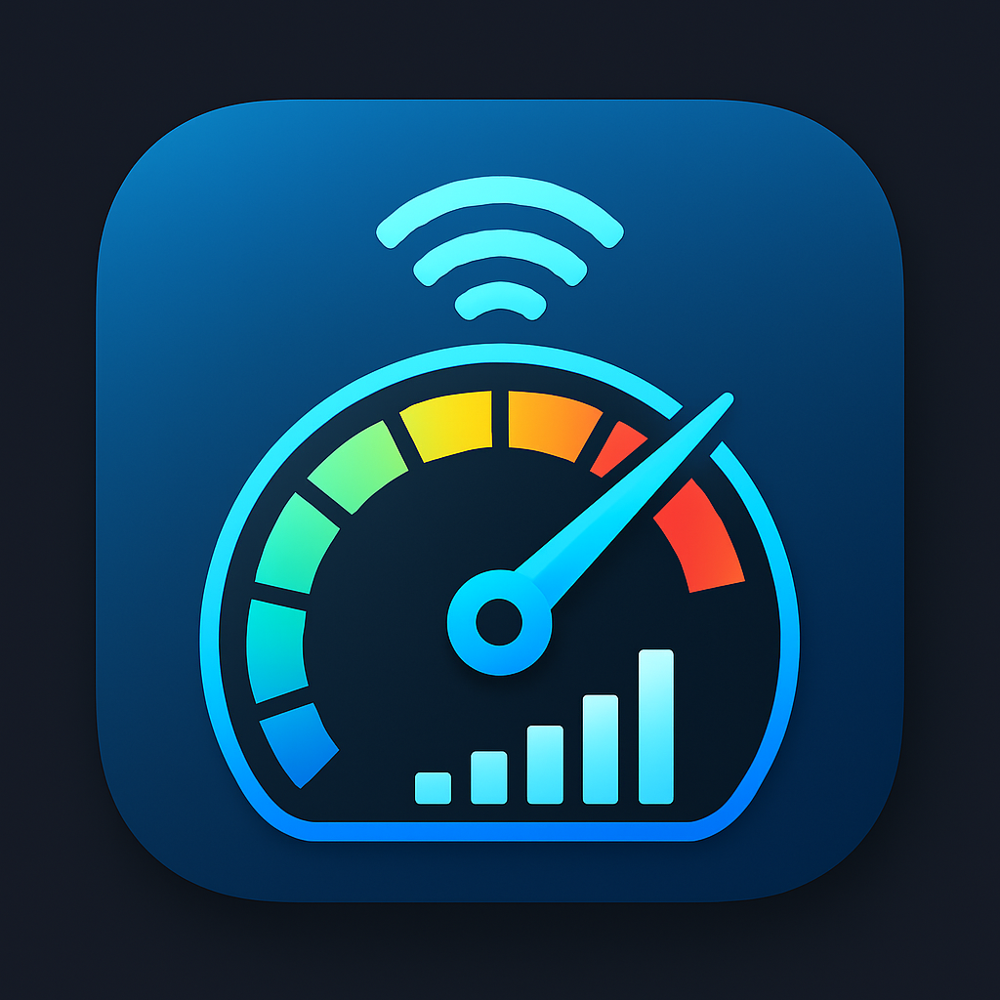
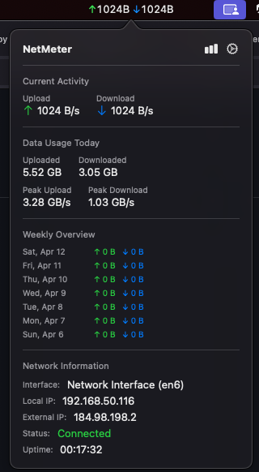
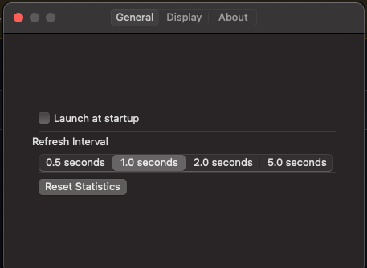
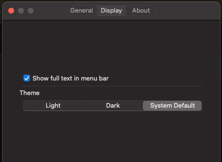
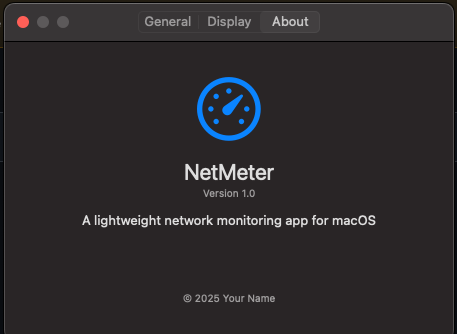

# NetMeter

<div align="center">
  
</div>

## 🔍 Overview

NetMeter is a lightweight, non-intrusive macOS application designed to monitor and display real-time internet speed directly in the macOS menu bar. It offers users instant visibility into their current network activity and provides additional statistics through a clean, expandable bubble interface.

NetMeter combines function and elegance, offering an intuitive user experience for casual users, developers, gamers, and remote professionals who want to keep tabs on their network usage without cluttering their workspace.

## ✨ Features

- **Menu Bar Display**: Real-time upload and download speeds directly in your macOS menu bar
- **Detailed Statistics**: Access comprehensive network statistics by left-clicking the menu bar icon
- **Interface Information**: View active network interface, internal IP, and external IP
- **Usage Tracking**: Monitor daily and peak usage statistics
- **Non-Intrusive Design**: Runs completely in the background with no Dock icon
- **Resource Efficient**: Minimal CPU and memory usage

## 📸 Screenshots

<div align="center">
  <br>
  <em>Menu Bar Display</em>
  
  <br><br>
  
  <br>
  <em>Statistics Popup</em>
  
  <br><br>
  
  <br>
  <em>Preferences Window 1</em>

  <br><br>
  
  <br>
  <em>Preferences Window 2</em>

  <br><br>
  
  <br>
  <em>Preferences Window 3</em>
</div>

## 🖥️ System Requirements

- macOS 14+ (Sonoma or later)
- Apple Silicon or Intel processors
- Minimal disk space (< 10MB)

## 📦 Installation

### Option 1: Download Release

1. Go to the [Releases](https://github.com/career-maverick/netmeter/releases) page
2. Download the latest `.dmg` file
3. Open the DMG and drag NetMeter to your Applications folder
4. Launch NetMeter from your Applications folder

### Option 2: Build from Source

1. Clone the repository:
```bash
git clone https://github.com/yourusername/netmeter.git
```

2. Open the project in Xcode:
```bash
cd netmeter
open NetMeter.xcodeproj
```

3. Build the project (⌘+B) and run (⌘+R)

4. To create a standalone app, select Product > Archive

## 🚀 Usage

- **View Network Speed**: NetMeter automatically displays your current upload and download speeds in the menu bar
- **View Detailed Statistics**: Left-click the menu bar icon to open the statistics popup
- **Access Settings and Quit**: Right-click the menu bar icon to access preferences or quit the application
- **Configure Settings**: Adjust refresh interval, display options, and startup behavior in Preferences

## ⚙️ Configuration

Access preferences by right-clicking the NetMeter icon in the menu bar and selecting "Preferences...". From there, you can:

- Toggle launch at startup
- Adjust the refresh interval
- Change theme options (Light/Dark/System)
- Reset statistics

## 🔧 Technical Details

NetMeter operates by monitoring network interfaces using native macOS frameworks. It:

- Uses IOKit and Network frameworks for accurate network statistics
- Updates data at customizable intervals (default: 1 second)
- Stores daily usage statistics locally
- Runs efficiently with minimal resource usage

## 🤝 Contributing

Contributions are welcome! If you'd like to contribute:

1. Fork the repository
2. Create a feature branch (`git checkout -b feature/amazing-feature`)
3. Commit your changes (`git commit -m 'Add some amazing feature'`)
4. Push to the branch (`git push origin feature/amazing-feature`)
5. Open a Pull Request

Please ensure your code follows the project's coding style and includes appropriate tests.


## 💡 Acknowledgments

- [Apple's Network Framework Documentation](https://developer.apple.com/documentation/network)
- [SwiftUI Framework](https://developer.apple.com/xcode/swiftui/)
- Icons and design inspiration from macOS system utilities

---

<div align="center">
  <p>Made with ❤️ for the macOS community</p>
</div>
